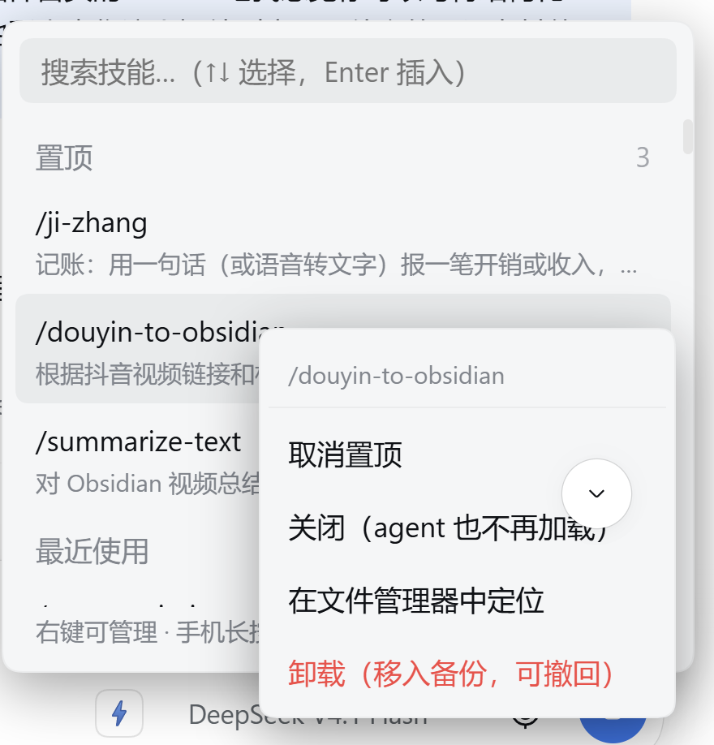

# dsh-skill-picker

[](https://www.npmjs.com/package/dsh-skill-picker)
[](https://github.com/a735624258/dsh-skill-picker/blob/main/LICENSE)

> **给 DSH 的输入框加一个 ⚡ 按钮：点开是你装过的全部技能（带说明），搜一下、点一下，`/技能名` 就进了发送框，DSH 自己把技能加载起来执行。**

**English** — A skill picker for the DSH Web GUI. A ⚡ button in the composer lists every installed skill with its description; picking one inserts the official `/skill-name` gesture into your draft, so DSH loads that skill with your message.

| | |
|---|---|
| 当前版本 | v0.5.28 |
| 许可 | MIT |
| 平台 | DSH 网页端 / 桌面端（Electron）/ 手机浏览器 |
| 内核 | DSH `0.1.x` 与 `0.2.x`（见 [4.4](#44-兼容性与注意事项)） |

---

## 1、为什么要做

DSH 本来就会认 `/技能名` 这个手势 —— 你在消息里写 `/ji-zhang 午饭 12 块`，它自动加载「记账」技能来执行。**官方只配了一个 `/` 补全，而它靠两样东西：**

1. **前缀匹配** —— 你得打对技能名的开头几个字母
2. **你的记忆** —— 装了五六十个技能，谁记得住每个叫什么

于是最常见的场面是：明明装了「备份记忆」，却想不起来它叫 `backup-memory`，翻不到就放弃了。

## 2、它做什么



1. **看得见** —— 输入框旁边一个 ⚡，点开是全部技能 + 完整描述
2. **搜得到** —— 中文、拼音（`jiyi` / `ji yi` / `jy`）、英文都行，技能名和描述一起搜
3. **选得快** —— 最近使用靠前、可手动置顶、`↑↓` + `Enter` 全程键盘
4. **管得了** —— 右键（手机长按）：置顶 / 关闭 / 在文件管理器中定位 / 卸载（移入备份，可撤回）
5. **到处一致** —— 置顶和最近使用在桌面端、网页端、手机之间共用同一份

**它和官方 `/` 补全不冲突，可以同时用**：记得住名字用官方，记不住用它。

## 3、怎么用

1. 看输入框右下角（模型选择器旁边），点 **⚡**
2. 敲关键字（中文 / 拼音 / 英文），列表实时过滤；也可以直接 `↑↓` 翻
3. 点中技能（或按 `Enter`）—— 发送框里出现 `/技能名 `，**光标停在末尾**
4. 接着把话说完，回车发送 —— DSH 自动加载这个技能

例子：点 ⚡ → 搜 `jiyi` → 点 `/ji-zhang` → 打上「今天午饭 12 块」→ 发送。

| 操作 | 效果 |
|---|---|
| 点 ⚡ | 打开技能面板 |
| `↑` `↓` / `Enter` / `Esc` | 选择 / 插入 / 关闭 |
| 右键技能行（手机长按 500ms） | 管理菜单：置顶 / 关闭 / 定位 / 卸载 |
| 面板右下角「已关闭 N」 | 查看并恢复被关闭的技能 |
| 输入框直接打 `/` | 官方斜杠菜单（本插件同样增强了它的匹配与排序） |

## 4、安装

### 4.1 三条路，按需要选一条

1. **要最新版** —— GitHub 直装（git 依赖直接拉最新 commit，不受 npm 24 小时门禁影响）
   ```sh
   dsh plugin --profile web add "git+ssh://git@github.com:a735624258/dsh-skill-picker.git"
   ```
2. **要 npm 正式版** —— 先查版本号，再按版本号装（**别用裸名**）
   ```sh
   npm view dsh-skill-picker version                      # 例如 0.5.28
   dsh plugin --profile web add dsh-skill-picker@0.5.28
   ```
3. **要改代码** —— clone 下来用 link 模式装
   ```sh
   git clone https://github.com/a735624258/dsh-skill-picker.git
   dsh plugin --profile web add link:/path/to/dsh-skill-picker
   ```

> ⚠️ 裸名安装（`add dsh-skill-picker`）在新版本发布后 **24 小时内**会被 pnpm 的 `minimumReleaseAge` 门禁拦下、**自动落回旧版**。照上面三条走就不会装错。

### 4.2 装完必须重启

host 路由是**进程启动时加载**的，只开个新标签页不生效：

| 你用的是 | 怎么重启 |
|---|---|
| 网页端 | 重启 `dsh web` 进程，必要时 `Ctrl+F5` 硬刷 |
| 桌面端 | 重启 `DeepSeek Harness.exe` 进程 |

### 4.3 网络与卸载

1. HTTPS 慢或不通 → 改用 SSH：`git clone git@github.com:a735624258/dsh-skill-picker.git`
2. 想让 pnpm 一律走 SSH：`git config --global url."git@github.com:".insteadOf "https://github.com/"`
3. `dsh` 被 PowerShell 执行策略挡下 → `powershell -ExecutionPolicy Bypass -Command "dsh plugin --profile web add link:C:\path\to\dsh-skill-picker"`
4. 卸载：`dsh plugin --profile web remove dsh-skill-picker`

### 4.4 兼容性与注意事项

| 内核版本 | 状态 |
|---|---|
| `0.1.0-rc.6` ~ `0.1.x` | 支持 |
| `0.2.0-rc.1` / `rc.2` 及 `0.2.x` | 支持（当前主用、实测） |
| `1.0.0` 及以上 | 需要重新确认 |

1. **peer 范围写得宽是故意的** —— `^0.1.0-rc.6 || >=0.2.0-rc.1 <1.0.0-0`。内核包与内核锁步同版本，钉死一个小版本线会让插件在内核升级时被**误拒**（日志一句 `skipping profile bundle`，表现是 ⚡ 按钮凭空消失）
2. **技能读哪些目录** —— 项目级 `<工作区>/.dsh/skills`、`<工作区>/.agents/skills`；用户级 `~/.dsh/skills`、`~/.agents/skills`（`$DSH_AGENTS_HOME` 可覆盖）；同名时项目级优先
3. **符号链接 / Junction 型技能会被跟随读取**；`user-invocable: false` 的技能不列出（列出来点了也会被官方静默跳过）
4. **桌面端无需任何手工处理**（v0.5.15 起）：官方技能 UI 在 `app.asar` 里还是普通目录都不影响
5. **手机端需配套** —— `dsh-pocket` 的「切会话不抢焦点」补丁与本插件的 `window.__dshSkillPickerFocusing` 豁免牌是一对，只装一边会出现「切会话抢焦点」或「插完技能光标不回」
6. **暂不支持**自定义技能目录（官方 `customSkillDirs`）—— 欢迎 PR

## 5、它是怎么做到的

```
[客户端]  输入框旁的 ⚡ 按钮
             ↓ 取技能列表（先官方 skills API，失败回退宿主扫描）
[宿主]    技能目录 → 名字 + 描述
             ↓ 你点选
[客户端]  把 "/技能名 " 追加进发送框
             ↓ 发送
[DSH]     agent/pre-step 认出 /技能名 手势 → 加载技能 → 执行
```

**本插件只补 UI 这一层**，加载与执行走 DSH 官方既有机制（`dsh-tool-skill` 扫描用户消息里的 `/kebab-case-name`），不碰 agent、不改官方代码。

1. **列表两条路** —— 优先走官方宿主 skills API（`remote.skills.list`，与官方 `/` 补全同源、自动含用户级 + 项目级），不可用时回退到宿主扫描路由
2. **`/` 菜单的模糊 + 拼音**（v0.5.15 起）—— 运行时接管官方触发源，**一个文件都不动**。原因：官方不允许注册同名 `/` 源（重名直接抛错），而改官方文件在 `app.asar` / pnpm 硬链接 / 悬空软链下会静默失效
3. **技能管理路由有三道闸** —— 必须带 `x-dsh-skill-picker: 1` 自定义头；客户端只报技能名、路径由宿主自己查；路径必须恰好落在已知技能根的一层之下。**「卸载」从不删除**，只移进 `$DSH_HOME/skill-backups/`
4. **出错不拖垮** —— 插槽缺失时静默跳过，扫描失败返回空列表，状态同步失败退化成纯本地

## 6、开发

```sh
npm install                                    # 装依赖
npm run build                                  # src/ → lib/（client bundle 必须打成 __ModuleLoader__ 握手）
dsh plugin --profile web add link:$PWD         # link 模式装进 web profile，改源码即生效
node --test                                    # 测试
```

> ⚠️ 改完源码**必须 `npm run build`**：`lib/client.js` 是构建产物，ESM 源码不能直接当 client bundle 加载（DSH web shell 要求 `window.__ModuleLoader__.load({ id, factory })` 握手格式），否则启动报 `loaded without registering "dsh-skill-picker"`。

```
dsh-skill-picker/
├── package.json            # dsh.bundle.patch + dsh.client 声明 + 兼容性表
├── cordis.patch.yml        # bundle patch：把插件行插进 web profile
├── build.mjs               # esbuild 构建：host ESM + client CJS
├── src/
│   ├── index.js            #   host：技能目录路由 + agent 引导段
│   ├── skill-ops.js        #   host：关闭 / 开启 / 定位 / 卸载 / 撤回
│   ├── patch-ui-skill.js   #   host：旧文件补丁（默认关闭）+ 自动还原
│   ├── dir-entry.js        #   目录项读取（跟随符号链接 / Junction）
│   └── client/
│       ├── index.jsx       #   client：⚡ 面板（搜索 / 分组 / 排序 / 右键菜单）
│       ├── slash-source.js #   client：`/` 菜单的运行时接管
│       ├── shared-state.js #   client：跨端共享的置顶 / 最近使用
│       └── session-view.js #   client：会话身份与工作区 cwd
├── lib/                    # 构建产物（勿手改）
├── test/                   # node --test 用例（8 个文件）
└── docs/                   # 截图
```

测试最近一次结果：**88 用例 / 87 通过 / 1 跳过 / 0 失败**（跳过那条需要 Windows 建符号链接的权限）。

---

## 更新日志

最近 3 个版本：

- **v0.5.28** —— 新置顶的技能排到「置顶」分组的最前面
- **v0.5.27** —— 手机端「插完技能光标不回」的配套豁免牌
- **v0.5.26** —— ⚡ 面板可管理技能（右键菜单）+ 12 项细节修复

各版本说明（版本速览 + 12 个版本的详细说明）见 **[CHANGELOG.md](CHANGELOG.md)**。

---

MIT License · [LICENSE](LICENSE)
